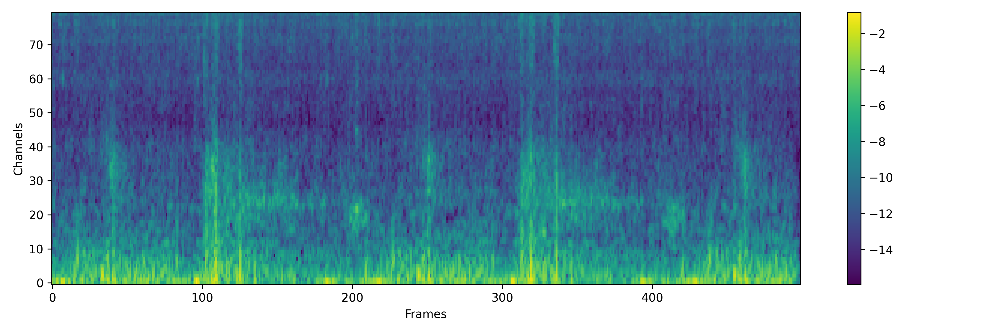
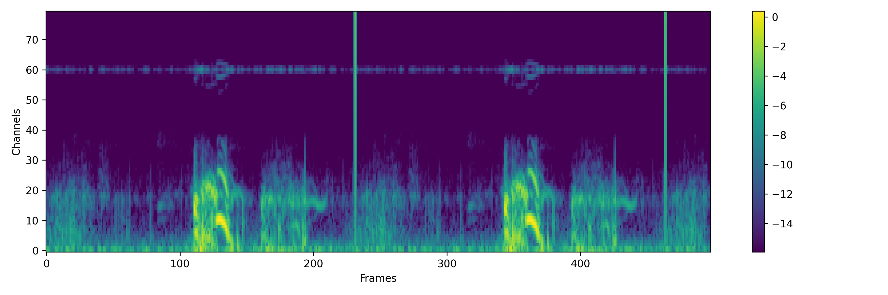

# Adversarial Fine-tuning using Generated Respiratory Sound to Address Class Imbalance

## Notion
To train or evalutate the audio diffusion model, please see ```Diffwave/``` folder.

To train or evalutate the respiratory sound classification task, please see ```Classification/``` folder.

## Generated Samples

### Label 'Normal'
<section>

<p>
  <span style="display:inline-block; width:600px; text-align:center">(Test Real) 147_2b4_Pl_mc_AKGC417L_event_2_label_0.wav</span>
  <span style="display:inline-block; width:600px; text-align:center">(ICBHI Audio Diffusion) 147_2b4_Pl_mc_AKGC417L_event_2_label_0.wav</span>
</p>

<audio controls>
  <source src="Diffwave/samples/test_set_samples/147_2b4_Pl_mc_AKGC417L_event_2_label_0.wav" type="audio/wav">
</audio>
</img>
<audio controls>
  <source src="Diffwave/samples/generated_test_samples/147_2b4_Pl_mc_AKGC417L_event_2_label_0.wav" type="audio/wav">
</audio>
</img>

<p>
  <span style="display:inline-block; width:600px; text-align:center">(Test Real) 170_1b2_Tc_mc_AKGC417L_event_3_label_0.wav</span>
  <span style="display:inline-block; width:600px; text-align:center">(ICBHI Audio Diffusion) 170_1b2_Tc_mc_AKGC417L_event_3_label_0.wav</span>
</p>

<audio controls>
  <source src="Diffwave/samples/test_set_samples/170_1b2_Tc_mc_AKGC417L_event_3_label_0.wav" type="audio/wav">
</audio>
</img>
<audio controls>
  <source src="Diffwave/samples/generated_test_samples/170_1b2_Tc_mc_AKGC417L_event_3_label_0.wav" type="audio/wav">
</audio>
</img>

<p>
  <span style="display:inline-block; width:600px; text-align:center">(Test Real) 187_1b1_Ll_sc_Meditron_event_13_label_0.wav</span>
  <span style="display:inline-block; width:600px; text-align:center">(ICBHI Audio Diffusion) 187_1b1_Ll_sc_Meditron_event_13_label_0.wav</span>
</p>

<audio controls>
  <source src="Diffwave/samples/test_set_samples/187_1b1_Ll_sc_Meditron_event_13_label_0.wav" type="audio/wav">
</audio>
</img>
<audio controls>
  <source src="Diffwave/samples/generated_test_samples/187_1b1_Ll_sc_Meditron_event_13_label_0.wav" type="audio/wav">
</audio>
</img>

</section>

### Label 'Crackle'
<section>

<p>
  <span style="display:inline-block; width:600px; text-align:center">(Test Real) 176_2b3_Ar_mc_AKGC417L_event_2_label_1.wav</span>
  <span style="display:inline-block; width:600px; text-align:center">(ICBHI Audio Diffusion) 176_2b3_Ar_mc_AKGC417L_event_2_label_1.wav</span>
</p>

<audio controls>
  <source src="Diffwave/samples/test_set_samples/176_2b3_Ar_mc_AKGC417L_event_2_label_1.wav" type="audio/wav">
</audio>
</img>
<audio controls>
  <source src="Diffwave/samples/generated_test_samples/176_2b3_Ar_mc_AKGC417L_event_2_label_1.wav" type="audio/wav">
</audio>
</img>

<p>
  <span style="display:inline-block; width:600px; text-align:center">(Test Real) 178_1b2_Lr_mc_AKGC417L_event_11_label_1.wav</span>
  <span style="display:inline-block; width:600px; text-align:center">(ICBHI Audio Diffusion) 178_1b2_Lr_mc_AKGC417L_event_11_label_1.wav</span>
</p>

<audio controls>
  <source src="Diffwave/samples/test_set_samples/178_1b2_Lr_mc_AKGC417L_event_11_label_1.wav" type="audio/wav">
</audio>
</img>
<audio controls>
  <source src="Diffwave/samples/generated_test_samples/178_1b2_Lr_mc_AKGC417L_event_11_label_1.wav" type="audio/wav">
</audio>
</img>

<p>
  <span style="display:inline-block; width:600px; text-align:center">(Test Real) 216_1b1_Al_sc_Meditron_event_2_label_1.wav</span>
  <span style="display:inline-block; width:600px; text-align:center">(ICBHI Audio Diffusion) 216_1b1_Al_sc_Meditron_event_2_label_1.wav</span>
</p>

<audio controls>
  <source src="Diffwave/samples/test_set_samples/216_1b1_Al_sc_Meditron_event_2_label_1.wav" type="audio/wav">
</audio>
</img>
<audio controls>
  <source src="Diffwave/samples/generated_test_samples/216_1b1_Al_sc_Meditron_event_2_label_1.wav" type="audio/wav">
</audio>
</img>

</section>

### Label 'Wheeze'
<section>

<p>
  <span style="display:inline-block; width:600px; text-align:center">(Test Real) 147_2b2_Pl_mc_AKGC417L_event_2_label_2.wav</span>
  <span style="display:inline-block; width:600px; text-align:center">(ICBHI Audio Diffusion) 147_2b2_Pl_mc_AKGC417L_event_2_label_2.wav</span>
</p>

<audio controls>
  <source src="Diffwave/samples/test_set_samples/147_2b2_Pl_mc_AKGC417L_event_2_label_2.wav" type="audio/wav">
</audio>
</img>
<audio controls>
  <source src="Diffwave/samples/generated_test_samples/147_2b2_Pl_mc_AKGC417L_event_2_label_2.wav" type="audio/wav">
</audio>
</img>

<p>
  <span style="display:inline-block; width:600px; text-align:center">(Test Real) 218_1b1_Pr_sc_Meditron_event_2_label_2.wav</span>
  <span style="display:inline-block; width:600px; text-align:center">(ICBHI Audio Diffusion) 218_1b1_Pr_sc_Meditron_event_2_label_2.wav</span>
</p>

<audio controls>
  <source src="Diffwave/samples/test_set_samples/218_1b1_Pr_sc_Meditron_event_2_label_2.wav" type="audio/wav">
</audio>
</img>
<audio controls>
  <source src="Diffwave/samples/generated_test_samples/218_1b1_Pr_sc_Meditron_event_2_label_2.wav" type="audio/wav">
</audio>
</img>

<p>
  <span style="display:inline-block; width:600px; text-align:center">(Test Real) 223_1b1_Pr_sc_Meditron_event_7_label_2.wav</span>
  <span style="display:inline-block; width:600px; text-align:center">(ICBHI Audio Diffusion) 223_1b1_Pr_sc_Meditron_event_7_label_2.wav</span>
</p>

<audio controls>
  <source src="Diffwave/samples/test_set_samples/223_1b1_Pr_sc_Meditron_event_7_label_2.wav" type="audio/wav">
</audio>
</img>
<audio controls>
  <source src="Diffwave/samples/generated_test_samples/223_1b1_Pr_sc_Meditron_event_7_label_2.wav" type="audio/wav">
</audio>
</img>

</section>

### Label 'Both'
<section>

<p>
  <span style="display:inline-block; width:600px; text-align:center">(Test Real) 151_2p3_Al_mc_AKGC417L_event_2_label_3.wav</span>
  <span style="display:inline-block; width:600px; text-align:center">(ICBHI Audio Diffusion) 151_2p3_Al_mc_AKGC417L_event_2_label_3.wav</span>
</p>

<audio controls>
  <source src="Diffwave/samples/test_set_samples/151_2p3_Al_mc_AKGC417L_event_2_label_3.wav" type="audio/wav">
</audio>
</img>
<audio controls>
  <source src="Diffwave/samples/generated_test_samples/151_2p3_Al_mc_AKGC417L_event_2_label_3.wav" type="audio/wav">
</audio>
</img>

<p>
  <span style="display:inline-block; width:600px; text-align:center">(Test Real) 195_1b1_Ll_sc_Litt3200_event_3_label_3.wav</span>
  <span style="display:inline-block; width:600px; text-align:center">(ICBHI Audio Diffusion) 195_1b1_Ll_sc_Litt3200_event_3_label_3.wav</span>
</p>

<audio controls>
  <source src="Diffwave/samples/test_set_samples/195_1b1_Ll_sc_Litt3200_event_3_label_3.wav" type="audio/wav">
</audio>
</img>
<audio controls>
  <source src="Diffwave/samples/generated_test_samples/195_1b1_Ll_sc_Litt3200_event_3_label_3.wav" type="audio/wav">
</audio>
</img>

<p>
  <span style="display:inline-block; width:600px; text-align:center">(Test Real) 218_1p1_Pl_sc_Litt3200_event_6_label_3.wav</span>
  <span style="display:inline-block; width:600px; text-align:center">(ICBHI Audio Diffusion) 218_1p1_Pl_sc_Litt3200_event_6_label_3.wav</span>
</p>

<audio controls>
  <source src="Diffwave/samples/test_set_samples/218_1p1_Pl_sc_Litt3200_event_6_label_3.wav" type="audio/wav">
</audio>
</img>
<audio controls>
  <source src="Diffwave/samples/generated_test_samples/218_1p1_Pl_sc_Litt3200_event_6_label_3.wav" type="audio/wav">
</audio>
</img>

</section>


## Environmental set-up

### Environments
`Ubuntu xx.xx`  
`Python 3.8.xx`

# Install the proper version of PyTorch
```
pip3 install torch torchvision torchaudio
```
and
```
pip install -r requirements.txt
```

## Datasets

Download the ICBHI files and unzip it.
All details is described in the [paper w/ code](https://paperswithcode.com/dataset/icbhi-respiratory-sound-database)

```
wget https://bhichallenge.med.auth.gr/sites/default/files/ICBHI_final_database/ICBHI_final_database.zip
or 
wget --no-check-certificate  https://bhichallenge.med.auth.gr/sites/default/files/ICBHI_final_database/ICBHI_final_database.zip
```
To directly use our pre-processed ICBHI dataset for reproducibility, see in ```Diffwave/``` and ```Classification/``` folder

## ICBHI Data

The database consists of a total of 5.5 hours of recordings containing 6898 respiratory cycles, of which 1864 contain crackles, 886 contain wheezes, and 506 contain both crackles and wheezes, in 920 annotated audio samples from 126 subjects.

The downloaded data looks like [[kaggle](https://www.kaggle.com/datasets/vbookshelf/respiratory-sound-database), [paper w/ code](https://paperswithcode.com/dataset/icbhi-respiratory-sound-database)]:

<pre>
data/icbhi_dataset
├── metadata.txt
│    ├── Patient number
│    ├── Age
│    ├── Sex
│    ├── Adult BMI (kg/m2)
│    ├── Adult Weight (kg)
│    └── Child Height (cm)
│
├── official_split.txt
│    ├── Patient number_Recording index_Chest location_Acqiosotopm mode_Recording equipment
│    |    ├── Chest location
│    |    |    ├── Trachea (Tc),Anterior left (Al),Anterior right (Ar),Posterior left (Pl)
│    |    |    └── Posterior right (Pr),Lateral left (Ll),Lateral right (Lr)
│    |    |
│    |    ├── Acquisition mode
│    |    |    └── sequential/single channel (sc), simultaneous/multichannel (mc)
│    |    |
│    |    └── Recording equipment 
│    |         ├── AKG C417L Microphone (AKGC417L), 
│    |         ├── 3M Littmann Classic II SE Stethoscope (LittC2SE), 
│    |         ├── 3M Litmmann 3200 Electronic Stethoscope (Litt3200), 
│    |         └── WelchAllyn Meditron Master Elite Electronic Stethoscope (Meditron)
│    |    
│    └── Train/Test   
│
├── patient_diagnosis.txt
│    ├── Patient number
│    └── Diagnosis
│         ├── COPD: Chronic Obstructive Pulmonary Disease
│         ├── LRTI: Lower Respiratory Tract Infection
│         └── URTI: Upper Respiratory Tract Infection
│
└── patient_list_foldwise.txt
</pre>
